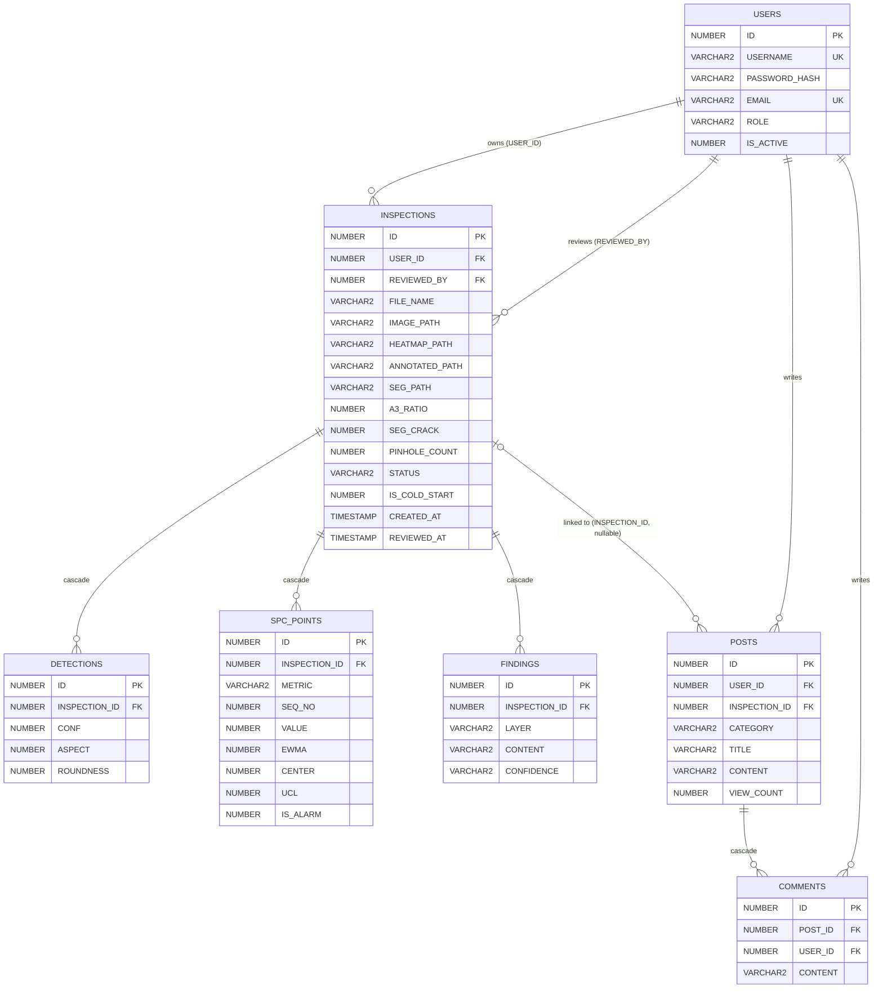

# 웹 애플리케이션 구조 (§3-6 갱신)

작성 시점: 2026-09-14. §2단계 모듈 분리 완료 + §3-1..3-5 Oracle DB 도입 · 인증 · 이력 · SPC · 게시판 완료 상태 기준. 보고서 3장 시스템 구성.

## 1. 디렉터리 트리

```
coating_vision/
├── run.py                       # 진입점. LD_LIBRARY_PATH 세팅 후 create_app().run()
├── app/                         # Flask 애플리케이션 패키지
│   ├── __init__.py              # create_app() 팩토리, blueprint 10 개 + nl2br 필터
│   ├── config.py                # 경로 상수 · Flask 설정 · Oracle DSN · WSL 호스트 IP 자동 감지
│   ├── store.py                 # JSON·CSV lazy 로드 + HEADLINE KPI
│   ├── db.py                    # SQLAlchemy engine lazy + get_session + ensure_ld_library_path
│   ├── models.py                # ORM 모델 7종
│   ├── auth_utils.py            # @login_required, @role_required, @api_login_required
│   ├── ml/                      # 모델 lazy 로드 · 스테이지 추론
│   │   └── {loader, anomaly, detect, segment, shape, advisor}.py
│   ├── services/                # 비즈니스 로직 (라우트에서 호출)
│   │   ├── pipeline.py          # /inspect 파이프라인 조립
│   │   ├── auth.py              # register, authenticate, get_current_user
│   │   ├── inspection_store.py  # 검사 저장/조회/삭제 + mark_reviewed + dashboard_summary
│   │   ├── spc.py               # add_spc_point, get_spc_series, get_recent_alarms
│   │   └── board.py             # 게시글 · 댓글 CRUD + has_report_for_inspection
│   ├── routes/                  # HTML blueprint
│   │   └── {main, stream, inspect, benchmark, auth, history, spc, board}.py
│   ├── api/                     # JSON blueprint
│   │   └── {sequence, spc}.py
│   ├── templates/               # Jinja2 (base, index, stream, inspect, benchmark,
│   │   │                            auth/*, history/*, board/*, spc.html)
│   └── static/                  # css/style.css · js/{stream, spc}.js · samples/ · uploads/
├── app_legacy.py                # §2단계 이전 원본 (1,008 줄, 참고용 백업, 삭제 금지)
├── sql/
│   ├── schema.sql               # DDL (테이블 7 + 시퀀스 7 + 트리거 7 + 인덱스 5)
│   ├── init_db.py               # 초기화 (idempotent) + admin 계정 seed
│   ├── migrate_3_4.py           # ADD IS_COLD_START, HEATMAP_PATH, ANNOTATED_PATH, SEG_PATH
│   └── migrate_3_5.py           # ADD REVIEWED_BY, REVIEWED_AT + FK
├── docs/
│   ├── architecture.md          # (이 문서)
│   ├── routes.md                # 라우트 인벤토리 (36개, 2026-09-16 재실측)
│   └── schema.md                # DB 스키마 표
├── requirements.txt             # 10 개 의존성
├── .env.example                 # 커밋됨
├── .env                         # gitignored (DB 비번, SECRET_KEY, ADMIN_PASSWORD)
└── … (실험 스크립트 01~45, JSON/CSV 산출물, figures/, runs/)
```

## 2. 계층 다이어그램

```
    ┌─────────────────────────────────────────────────┐
    │  브라우저 (사용자)                                │
    │      HTTP request (with session cookie)         │
    │      ▼                                          │
    │  Flask routing (create_app 이 등록한 blueprint)   │
    │      ▼                                          │
    │  routes/*, api/*        HTML 렌더 · JSON 응답   │
    │      │  auth 데코레이터 (login_required 등)      │
    │      ▼                                          │
    │  services/*             비즈니스 로직 · 권한 판정 │
    │      │  (auth · inspection_store · spc · board  │
    │      │   · pipeline)                            │
    │      ▼                                          │
    │  ml/*                   모델 lazy 로드 · 추론    │
    │      │  (loader · anomaly · detect · segment    │
    │      │   · shape · advisor)                     │
    │      ▼                                          │
    │  models.py              SQLAlchemy ORM 7 모델   │
    │      ▼                                          │
    │  db.py                  Engine lazy + Session   │
    │      │  커넥션 풀 5+5 · pool_pre_ping           │
    │      ▼                                          │
    │  config.py              경로 상수 · DSN         │
    │      ▼                                          │
    │  Oracle 11g XE          (원격 호스트, WSL IP 자동감지) │
    └─────────────────────────────────────────────────┘
```

**규칙**: 위쪽 계층이 아래를 import. 아래에서 위 참조 금지. `services/inspection_store.py` 는 `services/spc.py`, `services/board.py` 를 참조하나 이는 같은 계층 내부 의존이므로 허용 (순환 없음: `spc → models`, `board → models` 이므로 안전).

## 3. ERD (mermaid)

> ORM 관점의 Class Diagram (`relationship`, `foreign_keys=`, cascade 포함) 은 [`docs/uml.md` §2.1](uml.md) 을 참고. 이 절은 **DB 스키마 관점** 의 ERD 이며, 컬럼 상세는 [`docs/schema.md`](schema.md).




세부 컬럼과 CHECK 는 `docs/schema.md` 참고.

## 4. 요청 흐름 (1) — `/inspect` POST (검사 실행 + DB 저장 + SPC)

```
브라우저 -- POST /inspect (form: image) -->  routes/inspect.py :: inspect_page
                                              │  @login_required
                                              │  ml_loader.is_yolo_loaded() 캡처 (콜드 여부)
                                              ▼
                                       services/pipeline.py :: run_inspection
                                              │  파일 저장 (config.UPLOADS_DIR)
                                              ├── ml.anomaly.run_anomaly_stage
                                              ├── ml.anomaly.save_heatmap
                                              ├── ml.detect.run_detect_stage    (YOLO)
                                              ├── ml.segment.run_seg_stage      (U-Net)
                                              ├── ml.shape.run_shape_stage
                                              └── ml.advisor.build_advisor
                                              ▼ payload dict
                              services/inspection_store.py :: save_inspection
                                              │  트랜잭션 A (get_session)
                                              │  INSPECTIONS 1 + DETECTIONS N + FINDINGS N
                                              │  is_cold_start 반영
                                              ▼
                                       services/spc.py :: add_spc_point × 2  (트랜잭션 B)
                                              │  metric='a3', metric='seg_crack'
                                              │  baseline 30 이면 관리한계 산출 + is_alarm 판정
                                              ▼ alarm 발생 시
                              INSPECTIONS.STATUS = 'alarm'   (트랜잭션 C)
                                              ▼
                              render_template inspect.html
                              (crack, delam, A3, YOLO 결과 + inspection_id)
                                              ▼
브라우저 <-- 200 HTML (오버레이 이미지 4개 + Advisor 3층 + 이력 링크)
```

SPC 트랜잭션이 실패해도 검사 저장은 유지 (§3-3 원칙). DB 자체 실패 시 라우트는 flash 로 알리고 계산 결과만 렌더.

## 5. 요청 흐름 (2) — `/board/<id>` GET (조회수 증가 + 댓글)

```
브라우저 -- GET /board/5 (session cookie) -->  routes/board.py :: board_detail
                                                │  @login_required
                                                ▼
                                        services/board.py :: get_post
                                                │  post = session.get(Post, 5)
                                                │  if post.user_id != viewer_user_id:
                                                │      post.view_count += 1
                                                │  (본인 글은 증가 안 함)
                                                │
                                                │  inspection_id 있으면 Inspection 조회 →
                                                │      inspection_summary 포함
                                                │
                                                │  Comment 조인 User → comment_list (asc created_at)
                                                ▼ detail dict (post + inspection + comments)
                                        render_template board/detail.html
                                                │
                                                │  Jinja2 자동 이스케이프
                                                │  content 는 nl2br 필터로 개행 → <br>
                                                │  (escape 후 개행 치환, |safe 없음)
                                                ▼
브라우저 <-- 200 HTML (조회수 갱신, 댓글 목록, 연결된 검사 요약)
```

## 6. 인증 · 권한 구조

**세션**: Flask 세션 쿠키. `SECRET_KEY` 로 서명. 저장 키는 `user_id` 와 `role` 두 개뿐. 비밀번호·해시·이메일 등 세션에 저장하지 않음.

**비밀번호**: `werkzeug.security.generate_password_hash` (자동 scrypt, 알고리즘 접두 포함) + `check_password_hash`. 직접 구현 없음.

**요청 흐름 (로그인)**:
1. POST /login → `services/auth.authenticate(username, password)` 호출
2. `IS_ACTIVE = 0` 이면 거부, 비번 불일치면 거부
3. 성공 시 `LAST_LOGIN_AT` 갱신 + `session.clear()` + `session["user_id"]`, `session["role"]`
4. 리다이렉트 (next 파라미터 있으면 원래 URL, 없으면 `/`)

**데코레이터** (`auth_utils.py`):

| 이름 | 동작 | 실패 시 응답 |
|---|---|---|
| `@login_required` | 세션 없거나 만료 → /login | 302 → /login?next=... |
| `@role_required('manager','admin')` | role 위계 판정 (admin > manager > inspector) | 403 (HTML) |
| `@api_login_required` | API 라우트용 | 401 JSON `{"error":"authentication required"}` |

**role 위계**: `ROLE_RANK = {inspector:1, manager:2, admin:3}`. `@role_required('manager')` 는 `min_rank=2` 이상 (manager, admin) 통과. inspector 는 403.

**open-redirect 방지**: `_safe_next_url` (routes/auth.py) 이 `/` 시작 상대 경로만 허용, `//` 시작 URL 은 거부.

**context_processor**: 모든 템플릿에서 `current_user` 사용 가능 (`app/__init__.py:inject_current_user`). DB 실패 시 `None` 반환하여 템플릿이 깨지지 않음.

## 7. Oracle 11g 제약과 대응

| 제약 | 대응 |
|---|---|
| IDENTITY 컬럼 없음 | SEQUENCE 7 + BEFORE INSERT TRIGGER 7 |
| BOOLEAN 없음 | `NUMBER(1) + CHECK IN (0,1)` |
| ENUM 없음 | `VARCHAR2 + CHECK IN (...)` |
| LIMIT/OFFSET 없음 (12c 부터 지원) | SQLAlchemy 가 자동으로 ROWNUM 서브쿼리 생성 |
| Instant Client shared library **순환 의존** (libnnz19 ↔ libclntshcore ↔ libclntsh) | `LD_LIBRARY_PATH` 를 `os.execvpe` 로 사전 세팅해 자기 자신 재실행 (`app/db.py:ensure_ld_library_path`). 진입점 `run.py`·`sql/*.py` 상단 필수 |
| 11g XE 는 python-oracledb thin 모드 미지원 | `oracledb.init_oracle_client(lib_dir=...)` 로 thick 모드 |

## 8. Lazy 로드 · 시작 시간

**정적 산출물** (JSON/CSV)·**모델 가중치**·**DB Engine** 모두 최초 사용 시점에 로드. 모듈 import 시 파일·네트워크 접근 없음.

| 단계 | 시작 시간 | 대 legacy |
|---|---|---|
| legacy (§2단계 전, 단일 app.py) | 3,735 ms | 기준 |
| §2단계 (a) 정적 산출물 lazy | 3,604 ms | -3.5% |
| §2단계 (b) 모델도 lazy | 223 ms | -94.0% |
| §2단계 (c) blueprint 도입 | 350 ms | -90.6% |
| §2단계 (d) templates·static 이동 | 257 ms | -93.1% |
| §3-1 이후 (DB 계층 추가, LD_LIBRARY_PATH 사전 세팅 시) | ~300 ms | -92.0% |

**측정 시점**: 257 ms 는 §2단계 재구조화 직후 측정값 (2026-09-14 전후). "3,735 → 257 ms · 93.1% 단축" 은 지연 로드 전환의 효과를 나타내며 이 수치는 유효.

**현재값**: **389.6 ms** (2026-09-16 재실측, 3회 median. 3회: 348.5 / 392.5 / 389.6). **증가 사유**: §3-7~§3-10 에서 admin/account/storage 모듈 · pytest 관련 계층 추가. 상세 및 재측정 명령은 `docs/metrics.md` §3-1.

**모델 로드 트리거**:
- YOLO: 첫 `/inspect` GET (`ml_loader.get_yolo()` 호출)
- 세그 (U-Net): 첫 `/inspect` POST 실행 시

**콜드 스타트 분리**: `is_cold_start=1` 로 저장된 검사는 `get_dashboard_summary` 의 평균 crack 통계에서 제외. `MS_YOLO / MS_SEG` 는 로드 시간 포함이므로 실제 추론 시간 지표로 부적합. 실측: 첫 검사 `MS_YOLO=2317ms` → 두번째 `MS_YOLO=116ms` (20×).

## 9. 진입점 실행

```bash
source .venv/bin/activate

# 최초 1회 초기화 (테이블 · 시퀀스 · 트리거 · 인덱스 · admin 계정)
python sql/init_db.py

# 웹앱 시작
python run.py                  # http://localhost:5000
```

`run.py` 최상단의 `app_db.ensure_ld_library_path()` 가 필요 시 `os.execvpe` 로 자기 자신을 재실행하여 `LD_LIBRARY_PATH` 를 세팅한다. 결과적으로 파이썬 프로세스 재시작 오버헤드 ~130 ms. systemd 등에서 `Environment=LD_LIBRARY_PATH=...` 를 지정하면 재실행 회피 가능.

Legacy `python app.py` 는 §2단계 (d) 에서 제거됨. `app_legacy.py` 는 참고용 백업.
