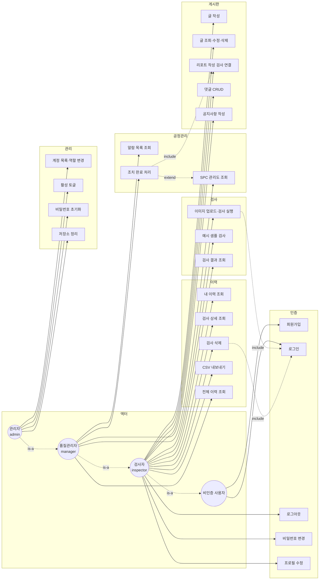
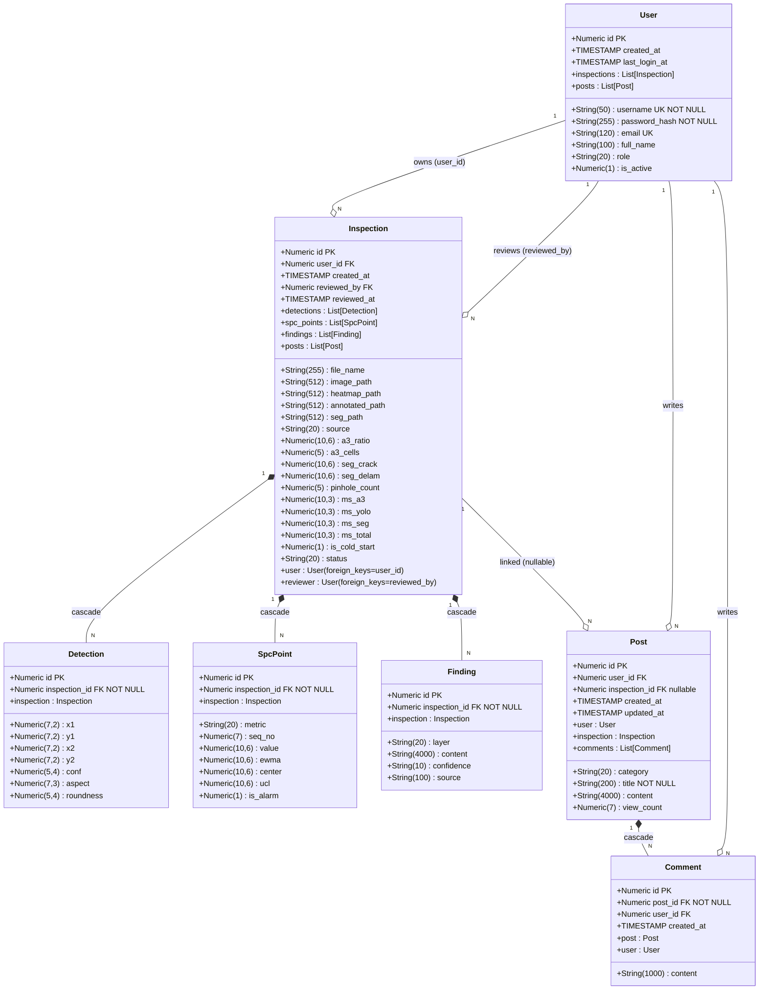
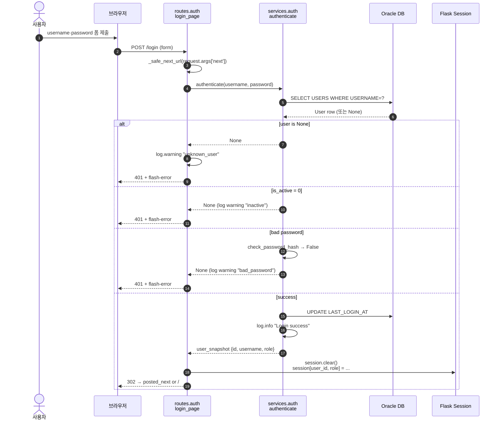
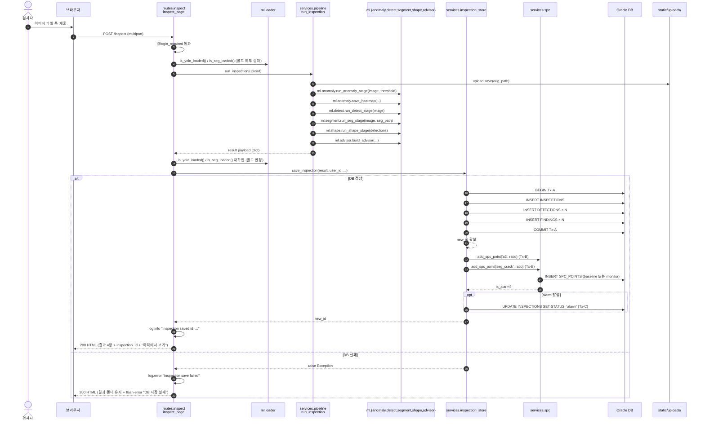
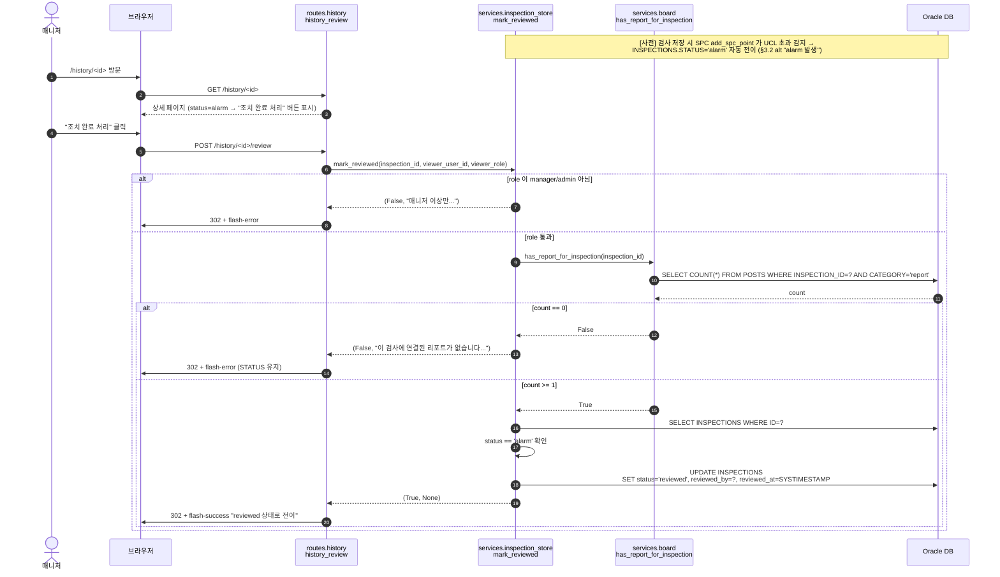
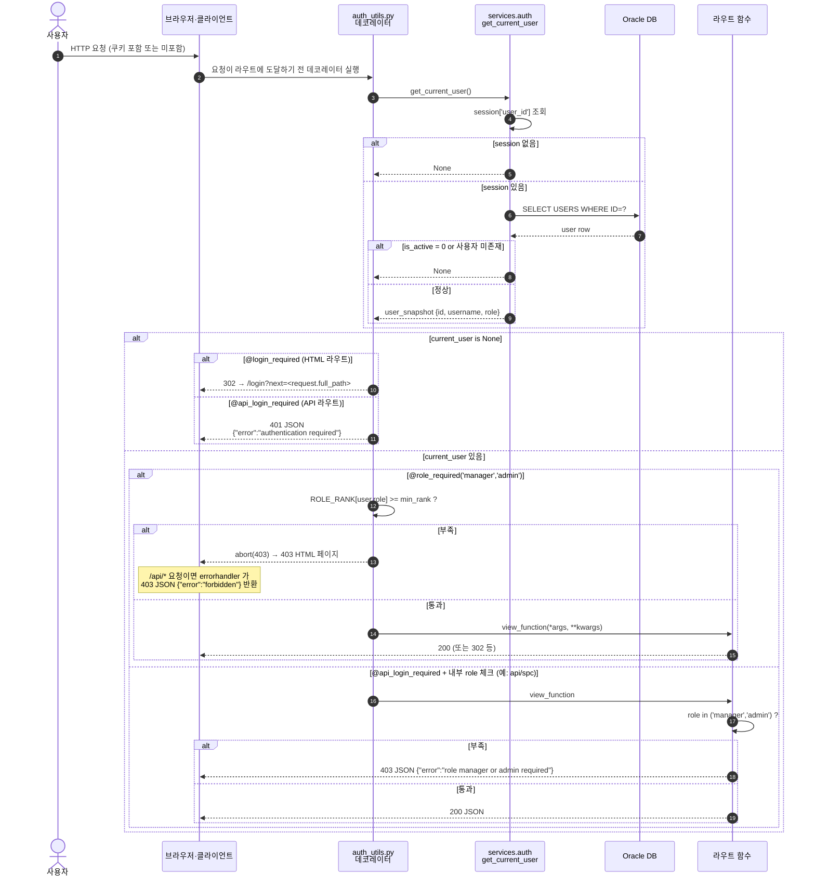

# UML 다이어그램 (§3-11)

작성 시점: 2026-09-14. 모든 다이어그램은 **mermaid** 문법. 코드를 읽어 실제 구조와 일치시켰다.

**중복 회피**: **ERD (테이블 관계)** 는 [`docs/architecture.md` §3](architecture.md) 에 존재하고, 여기서는 참조만. UML 은 **Use Case · Class · Sequence** 를 다룬다.

관련: [`docs/requirements.md`](requirements.md) · [`docs/routes.md`](routes.md) · [`docs/schema.md`](schema.md).

---

## 1. Use Case Diagram

Mermaid 는 UML use case 를 정식으로 지원하지 않는다. `flowchart` 로 액터 (왼쪽) 와 유스케이스 (오른쪽) 를 표현. `<<include>>`·`<<extend>>` 는 화살표 라벨.

**설명**:
- 액터는 4계층 (Anon → Inspector → Manager → Admin) 이며 위계 상속으로 상위가 하위 유스케이스를 모두 사용 가능. `@role_required` 데코레이터의 `ROLE_RANK` 위계와 일치.
- 실선 화살표 = 액터가 유스케이스를 직접 수행. 점선 = 상속·include·extend.
- **UC32 (조치 완료 처리)** 는 UC42 (리포트 작성 검사 연결) 를 `include` — `services/inspection_store.py:mark_reviewed` 가 `has_report_for_inspection` 을 필수 조건으로 확인.
- **UC32** 는 UC30 (SPC 관리도 조회) 을 `extend` — 알람 목록에서 곧바로 이동하는 확장 흐름. 필수 아님 (검사 상세 페이지에서 시작도 가능).
- UC44 (공지사항 작성) 는 manager 이상 전용 — UC40 (일반 글 작성) 의 카테고리 정책 분기이며 `services/board.py:create_post` 안에서 role 검사.

---

## 2. Class Diagram

### 2.1 도메인 모델 (ORM 7 클래스)

`app/models.py` 실제 클래스 · 컬럼 · relationship. Oracle 컬럼 이름은 대문자, ORM 속성은 소문자.

**설명**:
- **7 클래스 · 21 개 관계** (11 FK, 3 CASCADE). ERD 는 `docs/architecture.md` §3, 컬럼 상세는 `docs/schema.md`.
- `User ↔ Inspection` 은 FK 두 개 (`user_id`·`reviewed_by`) 로 관계 두 개. `foreign_keys=` 명시로 SQLAlchemy AmbiguousForeignKeysError 회피 (§3-5 이슈).
- `*--` (composition, CASCADE): 부모 삭제 시 자식도 삭제 (Oracle `ON DELETE CASCADE` FK 로 실제 구현). `--o` (aggregation): FK 는 있으나 부모 삭제 시 자식은 유지 (또는 NULL).
- `Inspection.posts` 는 nullable — 일반 게시글은 검사 연결 없음. report 카테고리만 검사와 연결.

### 2.2 애플리케이션 구조 (계층·모듈)

실제 import 관계. 화살표는 "of module A imports module B" 방향.

```mermaid
classDiagram
    class run_py["run.py<br/>진입점"]
    class create_app["app.__init__<br/>create_app 팩토리"]

    class routes_main["routes.main<br/>/ /figures /frame"]
    class routes_auth["routes.auth<br/>/login /register /logout"]
    class routes_account["routes.account<br/>/account /account/password"]
    class routes_inspect["routes.inspect<br/>/inspect /detection"]
    class routes_history["routes.history<br/>/history /export /review"]
    class routes_board["routes.board<br/>/board*"]
    class routes_spc["routes.spc<br/>/spc"]
    class routes_admin["routes.admin<br/>/admin/users /admin/storage"]
    class routes_stream["routes.stream<br/>/stream"]
    class routes_benchmark["routes.benchmark<br/>/benchmark"]
    class api_sequence["api.sequence<br/>/api/sequence"]
    class api_spc["api.spc<br/>/api/spc/series"]

    class services_pipeline["services.pipeline<br/>run_inspection"]
    class services_auth["services.auth<br/>register authenticate ..."]
    class services_inspection["services.inspection_store<br/>save get delete mark_reviewed"]
    class services_spc["services.spc<br/>add_spc_point compute_control_limits"]
    class services_board["services.board<br/>create_post get_posts ..."]
    class services_admin["services.admin<br/>list_users change_role ..."]
    class services_cleanup["services.cleanup<br/>delete_inspection_files ..."]

    class ml_loader["ml.loader<br/>get_yolo get_seg is_*_loaded"]
    class ml_anomaly["ml.anomaly<br/>run_anomaly_stage"]
    class ml_detect["ml.detect<br/>run_detect_stage"]
    class ml_segment["ml.segment<br/>run_seg_stage"]
    class ml_shape["ml.shape<br/>run_shape_stage"]
    class ml_advisor["ml.advisor<br/>build_advisor"]

    class models["models.py<br/>User Inspection Detection SpcPoint Finding Post Comment"]
    class db["db.py<br/>engine session ensure_ld_library_path"]
    class store["store.py<br/>get_advisor get_kpi ..."]
    class config["config.py<br/>경로 DSN"]
    class auth_utils["auth_utils.py<br/>@login_required @role_required @api_login_required"]
    class logging_conf["logging_config.py<br/>configure_logging"]

    run_py --> create_app
    create_app --> routes_main
    create_app --> routes_auth
    create_app --> routes_account
    create_app --> routes_inspect
    create_app --> routes_history
    create_app --> routes_board
    create_app --> routes_spc
    create_app --> routes_admin
    create_app --> routes_stream
    create_app --> routes_benchmark
    create_app --> api_sequence
    create_app --> api_spc
    create_app --> logging_conf

    routes_auth --> services_auth
    routes_account --> services_auth
    routes_inspect --> services_pipeline
    routes_inspect --> services_inspection
    routes_inspect --> ml_loader
    routes_inspect --> auth_utils
    routes_history --> services_inspection
    routes_history --> services_auth
    routes_history --> auth_utils
    routes_board --> services_board
    routes_board --> services_auth
    routes_board --> auth_utils
    routes_spc --> services_spc
    routes_spc --> auth_utils
    routes_admin --> services_admin
    routes_admin --> services_auth
    routes_admin --> services_cleanup
    routes_admin --> auth_utils
    routes_main --> services_auth
    routes_main --> services_inspection
    routes_main --> store
    routes_main --> auth_utils
    routes_stream --> store
    routes_stream --> auth_utils
    routes_benchmark --> store
    routes_benchmark --> auth_utils
    api_sequence --> store
    api_sequence --> auth_utils
    api_spc --> services_spc
    api_spc --> services_auth
    api_spc --> auth_utils

    services_pipeline --> ml_anomaly
    services_pipeline --> ml_detect
    services_pipeline --> ml_segment
    services_pipeline --> ml_shape
    services_pipeline --> ml_advisor
    services_pipeline --> store

    services_inspection --> models
    services_inspection --> db
    services_inspection --> services_spc
    services_inspection --> services_cleanup
    services_auth --> models
    services_auth --> db
    services_board --> models
    services_board --> db
    services_spc --> models
    services_spc --> db
    services_admin --> models
    services_admin --> db
    services_cleanup --> models
    services_cleanup --> db
    services_cleanup --> config

    ml_detect --> ml_loader
    ml_segment --> ml_loader
    ml_shape --> store
    ml_advisor --> store

    models --> db
    db --> config
    store --> config
    auth_utils --> services_auth
    logging_conf --> config
```

**설명**:
- 화살표 방향 = **import 방향**. 위쪽 (라우트) 에서 아래쪽 (config) 을 참조. 역방향 없음 (grep 확인 완료).
- `auth_utils.py` 는 `services.auth` 만 참조하고 routes 를 직접 import 하지 않음 (`url_for` endpoint 이름만 사용).
- `services/*.py` 는 서로 참조 가능 (같은 계층). 예: `inspection_store` 가 `spc` · `cleanup` · `board` 사용. 순환 없음.
- `ml/*.py` 는 서비스·라우트를 참조 안 함. 순수 계산 계층.
- `db.py`·`store.py`·`config.py` 는 최하위 (다른 것을 import 안 함).

---

## 3. Sequence Diagrams

### 3.1 로그인 (POST /login)

**설명**:
- 로그인은 `services.auth.authenticate` 하나로 검증 (unknown_user / inactive / bad_password / success). 각 사유별 로그 warning/info. 비밀번호 값은 로그에 남지 않음 (사유 문자열만).
- 세션은 `user_id`·`role` 두 키만 저장. Flask 서명 쿠키.
- `next` 파라미터는 `_safe_next_url` 통과한 경우에만 사용 — open-redirect 방지.

### 3.2 검사 실행 (POST /inspect, DB 저장 실패 alt 포함)

**설명**:
- 파이프라인은 **5 스테이지 순차 실행**. 파일 저장 · 이미지 처리는 request context 안에서. 모델은 lazy 로드 (첫 요청 시).
- **트랜잭션 3개 분리**: Tx-A (INSPECTIONS + DETECTIONS + FINDINGS), Tx-B (SPC × 2), Tx-C (STATUS 갱신). Tx-A 실패 → 전체 롤백 + flash. Tx-B/C 실패는 로그만 (검사 저장은 유지).
- **alt "DB 실패"**: `save_inspection` 예외 → 결과 payload 는 이미 파일로 저장돼 있으므로 화면 렌더는 유지. `inspection_id` 는 payload 에 세팅 안 됨 → "이력에서 보기" 버튼 숨겨짐.
- 콜드 스타트 감지는 파이프라인 전후 `is_yolo_loaded()` 비교로 판정, `IS_COLD_START=1` 저장 시 대시보드 평균 crack 통계에서 제외.

### 3.3 알람 발생 → 조치 완료 전이

**설명**:
- **선행 조건**: SPC 알람은 검사 저장 시 자동 판정 (§3.2 alt). 이 시퀀스는 조치 완료 흐름만.
- **거부 사유 세 층**: (1) role 부족, (2) report 부재, (3) STATUS 이미 reviewed 이거나 미존재. 모두 `mark_reviewed` 서비스 안에서 판정하고 사유를 반환 → 라우트가 flash-error 로 전달.
- `abort(403)` 대신 `redirect + flash` — 사유가 여러 가지라 사용자에게 알리기 위함 (§3-6 설계 노트).
- STATUS 유지: 거부 시 DB 변경 없음. `reviewed_by`·`reviewed_at` 은 성공 시에만 기록.

### 3.4 권한 검사 (HTML vs API 분기)

**설명**:
- **HTML vs API 분기 3 층**: (1) 데코레이터 종류로 미로그인 응답 분기 (302 vs 401 JSON), (2) `role_required` 는 HTML 라우트에서 `abort(403)` → `errorhandler` 가 요청 경로 (`/api/*` 여부) 로 최종 형식 결정, (3) `api_spc.spc_series` 는 내부에서 role 체크해 403 JSON 반환.
- `get_current_user` 는 매 요청마다 DB 를 조회 (세션 캐시 아님). 이유: 역할 변경·비활성화가 즉시 반영되어야 함 (§3-7 admin 이 bob 을 manager 로 승격 시 bob 의 다음 요청부터 /spc 200).
- `errorhandler` 는 `app/__init__.py` 안에서 등록. `_is_api_request()` = `request.path.startswith("/api/")`.
